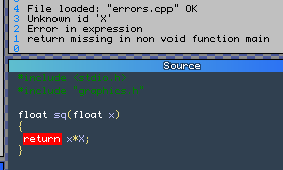

# Scinc


Scriptable C IN C / scinc (skink)

(pronounced as \[stsɪnk\])

_Skinks are lizards belonging to the family Scincidae and the infraorder Scincomorpha._
_(Wikipedia)_

Small and simple statically strong typed embeddable interpreted programming language.

Syntactical and semantical subset of C++. Can be embedded in another applications or run by interpreter. Scinc program is correct C++ program and thus can be compiled into native code without changes.

Current VM realization runs on own virtual processor and virtual address space. Speed is about 10-12 host CPU tacts per VM opcode. On modern 4.5 GHz desktop CPU it is ~420 million vm opcodes per second.

## Motivation

Scinc is intended to be used as a script embeddable language for high level application logic and for rapid functionality prototyping, with possibility to convert it into C++ with minimal effort.

Language itself is intended to be reasonably limited subset of C++, moving towards better compatibility with standard compilers. Constantly growing set of minimal feature tests is used to check it after all changes in lexer, parser, backend or VM. There are the reasons, why C++ was choosen:

* author knows C++ well enough
* there are a lot of editors/IDEs that support C++
* standard language with competing compilers allows easy and reliable tests: just compile test program with G++/Clang/MSVC and compare output stringwise
* no version compatibility quiestions: new versions of Scinc will be more and more compatible with C++ _(hopefully)_

## Language features and description

### So far, these base data types are supported:

Name|example|meaning
----|-------|----
`char`|`'a'`, `"12345"`|1 byte character. Single char literal implicitly converted to int, string literal "123456" is stored in constant segment, implicitly terminated with `'\0'` and converted to `char*` pointer to 0th element
`int`|`3`, `0xff`|signed integer, underlying type is default 32 bit signed int
`float`|`3.14`, `.5f`, `-1.5e+3`|IEEE float. Underlying native type is `double`, so, `sizeof(float)` equals `8` in Scinc

Arrays with compile time known sizes, structs, classes, pointers and references can be used to extend types. Struct can contain arrays or other structs, array can contain structs.

Major type conversions between base types are supported, however, they can cause extra operations and sometimes buggy or missing. It is known issue and author works on fixes and improvements

`struct`, `class` correspond to their C++ analogs. For now, there are some limitations:
* no bit fields
* no constructors and destructors
* members access (`public:`, `private:`, `protected:`) ignored, `const` is ignored too
* user defined overloaded operators don't support freestanding implementation yet
* `operator[]` and `operator->` cannot be overloaded for now

Function member can be declared as `static` and then called with namespace resolution operator `::`.

Variable declarations support only one variable at a time: `int a; int b;` is OK, `int a,b;` will cause an error.

Global variables can not be initialized.

Local variable declarations support initialization, arrays can be initialized with initialization lists: `int x[3]={1,2,3};`, missing items are implicitly 0. Be aware of the fact, that list is stored in constant segment and event empty list will occupy space, for example, `int x[4]={};` will be compiled into 4*sizeof(int) zero bytes.

Pointer and references are supported, but their usage in variable declarations is limited to one at a time, i.e. `int * ptrx;` is OK, `int ** ptrptrx;` is not.

## Preprocessor

Preprocessor supports object-style and function-style macros, `__SCINC__` macro is defined, can be useful if someone needs conditional compilation

`#include <...>` is ignored, `#include "..."` works, but only in current folder. Some include directives can be handled separatedly, for example, `#include "graphics.h"` will not cause compiler to for this file in current folder, instead graphic window will be created and some bindings to native functions will be made.

## Error messages

Error messages are sometimes confusing or missing, sometimes extra. No file/line/position included in error text, but someone can run Scinc with `-gui` command line switch, and find erroneous token highlighted if he is lucky enough



## Runtime library

Interpreter has some bindings to native functions, some kind of runtime library. This is not a part of the language and provided as an example. Can (and probably will) be changed in future.

```c++
// Predefined macros

#define Present() __builtin_interrupt ( 10 )
#define __SCINC__
#define bool int
#define exit(x) __builtin_finish ( x )
#define false 0
#define true 1

// Graphics with SVG 'path d="..."'-like semantics
// available if "graphics.h" is included
class Graph
{
	// Move to x,y
	void M(float,float);
	// Relative move to x,y
	void m(float,float);
	// Line to x,y
	void L(float,float);
	// Relative line to x,y
	void l(float,float);
	void pl(float,float);
	void pm(float,float);
	// Close shape
	void close();
	// Clear shape
	void clear();
	// Cubic Bezier curve
	void C(float,float,float,float,float,float);
	// Relative cubic Bezier curve
	void c(float,float,float,float,float,float);
	// Quadratic Bezier curve
	void Q(float,float,float,float);
	// Relative quadratic Bezier curve
	void q(float,float,float,float);
	// fill with nonzero rule
	void fill1();
	// fill with even-odd rule
	void fill2();
	// stroke contour
	void stroke();
	// finalize shape before filling or stroking
	void fin();
	// set color
	void rgba(float,float,float,float);
	void rgb(float,float,float);
	void gray(float);
	void alpha(float);
	// set stroke width
	void width(float,float);
	void graddef(float);
	void gradend();
	void gradstop(float,float,float,float,float);
	void gradient(float);
	void graduse(float);
	void g_0(float,float);
	void g_x(float,float);
	void g_y(float,float);
	void t_0(float,float);
	void t_x(float,float);
	void t_y(float,float);
	// 
	void next();
};

inline int glyph(int);
inline int gtext(char*);
inline int GC(char*);
inline void PutPixel(int,int,int);
inline int GetPixel(int,int);

// 
inline void Interrupt();
inline float Time();
// IO
inline int printf(char*,...);
inline int snprintf(char*,int,char*,...);
inline int puts(char*);
inline int stext(char*,int,int,int);
// math
inline float sin(float);
inline float cos(float);
inline float sqrt(float);
// User interaction
inline void GetMouseState(int&,int&,int&);
inline int GetKeyEvent(int&,int&);
inline int KeyPressed(int);
// sound
inline int snd_add(int);
inline void snd_data(int,int,float,float);
inline void snd_out(float,float);
inline void snd_play(int);
```
For information about VM and interpreter internals, see [Bytecode.md](Bytecode.md)
