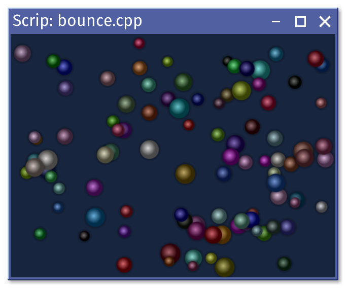
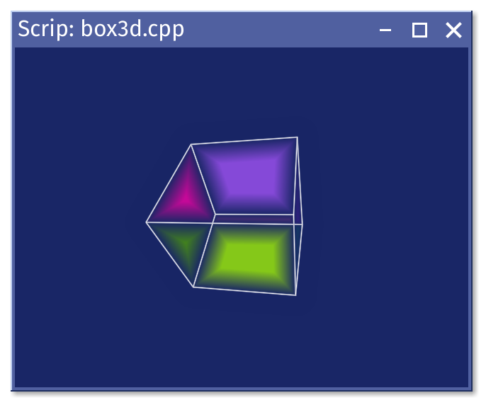
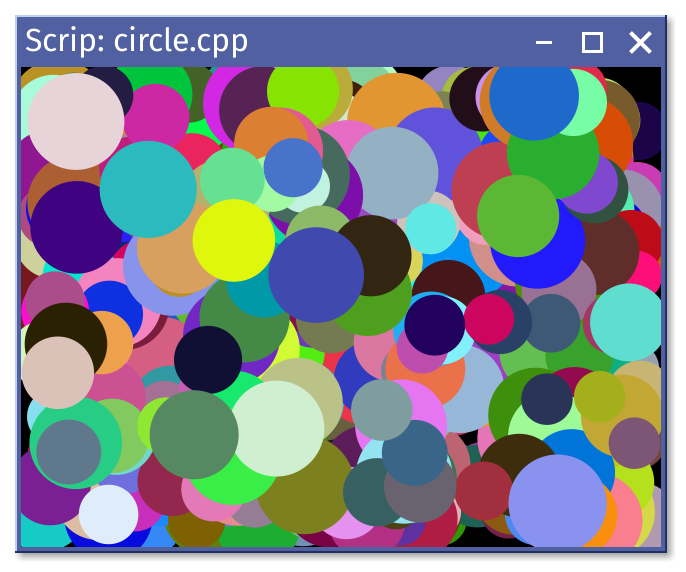

# Geometric exapmles

* **bounce.cpp** - some cheaply rendered spheres are bouncing from the edges of window

* **box3d.cpp** - rotating 3D cube, rendered with cheap 3D primitives

* **circle.cpp** - random colored circles, filled and stroked

